# Part C — MPI Distributed Cluster & Matrix Multiplication

## 1. Aim
To configure a distributed computing cluster across multiple nodes using OpenMPI, establish passwordless SSH communication, and parallelize dense matrix multiplication ($4000 \times 4000$) across distributed memory systems.

---

## 2. Objective
* To configure and verify network connectivity, hostname resolution, and OpenSSH on a master and worker nodes.
* To generate and distribute RSA SSH keys for passwordless inter-node execution.
* To deploy OpenMPI across all nodes and validate point-to-point and collective message passing.
* To implement distributed matrix multiplication using `MPI_Scatter`, `MPI_Bcast`, and `MPI_Gather`.
* To measure execution time, speedup, and parallel efficiency across the distributed cluster.

---

## 3. Cluster Topology & Network Architecture

The distributed computing experiment is deployed across a 4-node virtual machine cluster interconnected via a private network:

| Node Name | Hostname | IP Address | Cluster Role | Task Partitioning |
| :--- | :--- | :--- | :--- | :--- |
| **Master** | `master` | `192.168.190.128` | Rank 0 (Coordinator) | Manages cluster; computes rows 0 – 999 |
| **Worker 1** | `worker1` | `192.168.190.129` | Rank 1 (Worker) | Computes rows 1000 – 1999 |
| **Worker 2** | `worker2` | `192.168.190.130` | Rank 2 (Worker) | Computes rows 2000 – 2999 |
| **Worker 3** | `worker3` | `192.168.190.131` | Rank 3 (Worker) | Computes rows 3000 – 3999 |

---

## 4. Source Code

The complete source code is stored in [code/matrix_mpi.c](code/matrix_mpi.c):

```c
#include <stdio.h>
#include <stdlib.h>
#include <mpi.h>
#include <unistd.h>

#define N 4000

int main(int argc, char *argv[])
{
    int rank, size;
    int i, j, k;
    int rows_per_process;
    char hostname[256];

    double *A = NULL;
    double *B = NULL;
    double *C = NULL;
    double *local_A;
    double *local_C;

    double start, end;

    MPI_Init(&argc, &argv);

    MPI_Comm_rank(MPI_COMM_WORLD, &rank);
    MPI_Comm_size(MPI_COMM_WORLD, &size);

    gethostname(hostname, sizeof(hostname));

    if (N % size != 0)
    {
        if (rank == 0)
            printf("Matrix size must be divisible by number of processes.\n");

        MPI_Finalize();
        return 0;
    }

    rows_per_process = N / size;

    local_A = (double *)malloc(rows_per_process * N * sizeof(double));
    local_C = (double *)malloc(rows_per_process * N * sizeof(double));
    B = (double *)malloc(N * N * sizeof(double));

    if (rank == 0)
    {
        A = (double *)malloc(N * N * sizeof(double));
        C = (double *)malloc(N * N * sizeof(double));

        printf("Initializing %d x %d matrices...\n", N, N);

        for (i = 0; i < N; i++)
        {
            for (j = 0; j < N; j++)
            {
                A[i * N + j] = 1.0;
                B[i * N + j] = 1.0;
                C[i * N + j] = 0.0;
            }
        }
    }

    MPI_Barrier(MPI_COMM_WORLD);
    start = MPI_Wtime();

    MPI_Scatter(A, rows_per_process * N, MPI_DOUBLE,
                local_A, rows_per_process * N, MPI_DOUBLE,
                0, MPI_COMM_WORLD);

    MPI_Bcast(B, N * N, MPI_DOUBLE, 0, MPI_COMM_WORLD);

    printf("Rank %d on %s computing %d rows\n", rank, hostname, rows_per_process);

    for (i = 0; i < rows_per_process; i++)
    {
        for (j = 0; j < N; j++)
        {
            local_C[i * N + j] = 0.0;

            for (k = 0; k < N; k++)
            {
                local_C[i * N + j] += local_A[i * N + k] * B[k * N + j];
            }
        }
    }

    MPI_Gather(local_C, rows_per_process * N, MPI_DOUBLE,
               C, rows_per_process * N, MPI_DOUBLE,
               0, MPI_COMM_WORLD);

    MPI_Barrier(MPI_COMM_WORLD);
    end = MPI_Wtime();

    if (rank == 0)
    {
        printf("\nMPI Matrix Multiplication Completed\n");
        printf("Matrix Size = %d x %d\n", N, N);
        printf("Number of MPI Processes = %d\n", size);
        printf("Execution Time = %f seconds\n", end - start);
        printf("Verification C[0][0] = %.2f\n", C[0]);

        free(A);
        free(C);
    }

    free(B);
    free(local_A);
    free(local_C);

    MPI_Finalize();
    return 0;
}
```

---

## 5. Compilation, Staging & Execution

```bash
# 1. Compile on Master
mpicc -O2 matrix_mpi.c -o matrix_mpi

# 2. Stage binary to all Worker nodes
scp matrix_mpi worker1:~/matrix_mpi
scp matrix_mpi worker2:~/matrix_mpi
scp matrix_mpi worker3:~/matrix_mpi

# 3. Launch distributed MPI execution across cluster
mpirun -np 4 --hostfile hosts sh -c '$HOME/matrix_mpi'
```

---

## 6. Output & Verification

```text
Initializing 4000 x 4000 matrices...
Rank 0 on master computing 1000 rows
Rank 1 on worker1 computing 1000 rows
Rank 2 on worker2 computing 1000 rows
Rank 3 on worker3 computing 1000 rows

MPI Matrix Multiplication Completed
Matrix Size = 4000 x 4000
Number of MPI Processes = 4
Execution Time = 92.979510 seconds
Verification C[0][0] = 4000.00
```

---

## 7. Screenshots & Step-by-Step Verification

### 7.1 Network Ping Test
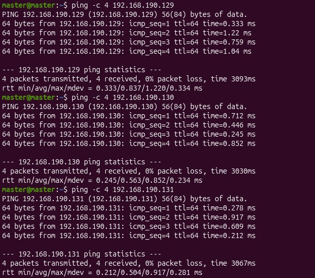
*Verifying 0% packet loss network connectivity from Master to Worker nodes.*

### 7.2 SSH Service on Worker Nodes
| Worker 1 SSH | Worker 2 SSH | Worker 3 SSH |
| :---: | :---: | :---: |
| 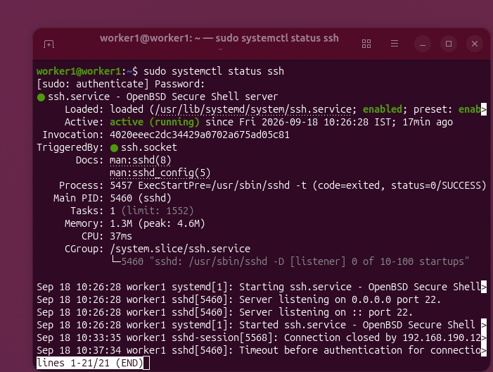 | 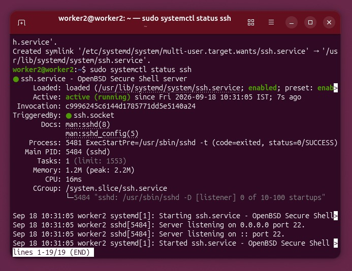 | 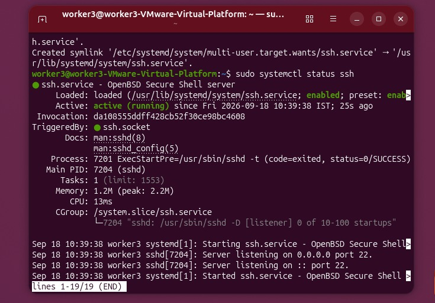 |

### 7.3 SSH Connection Tests
| Worker 1 Connection | Worker 2 Connection | Worker 3 Connection |
| :---: | :---: | :---: |
| 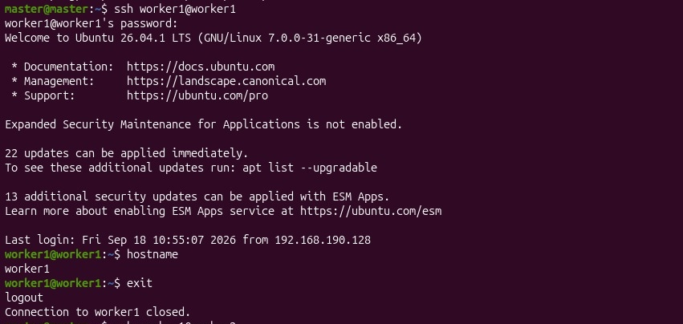 | 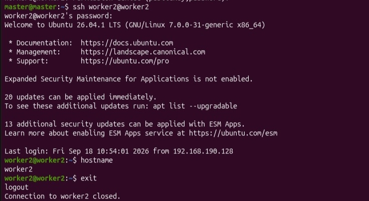 | 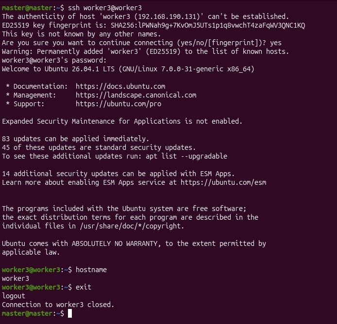 |

### 7.4 Passwordless SSH Key Setup
| Keygen on Master | Public Key Distribution | Passwordless Verification |
| :---: | :---: | :---: |
| 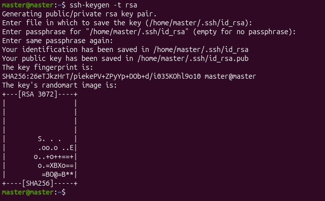 | 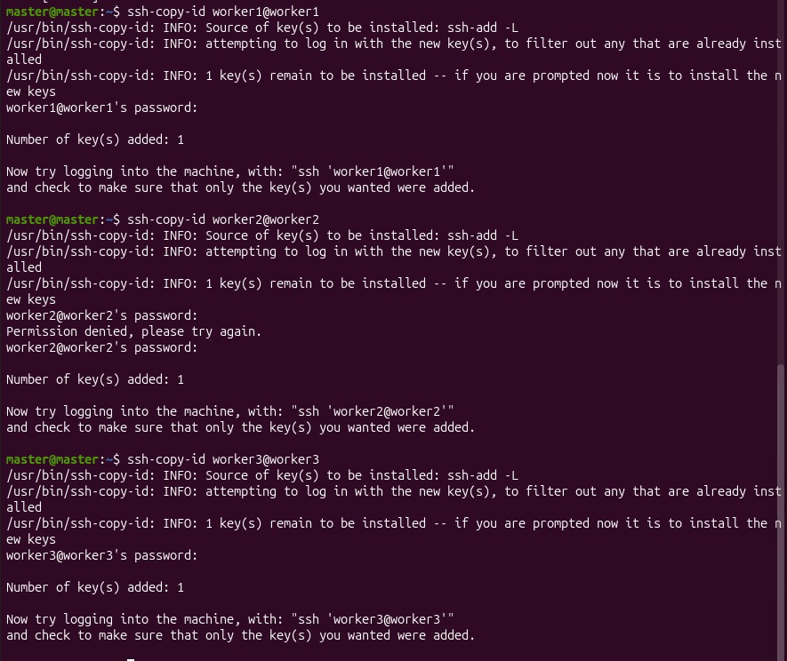 | 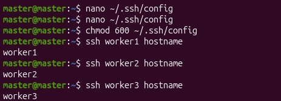 |

### 7.5 MPI Installation & Verification
| Master Installation | Master MPI Info | Worker Nodes MPI |
| :---: | :---: | :---: |
| 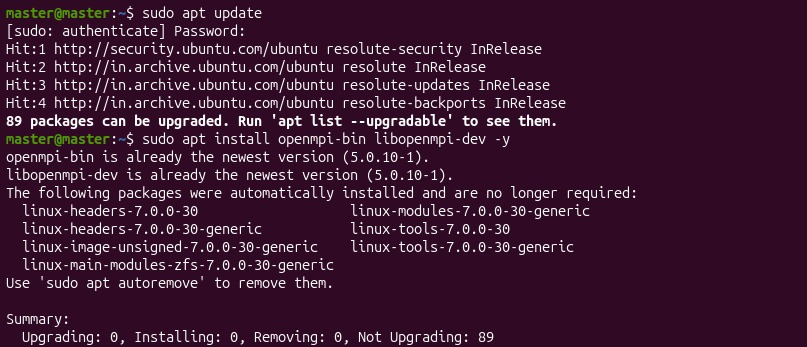 | 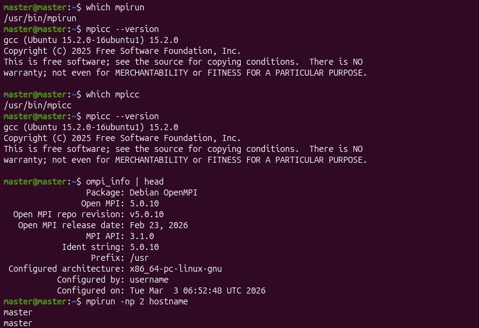 | 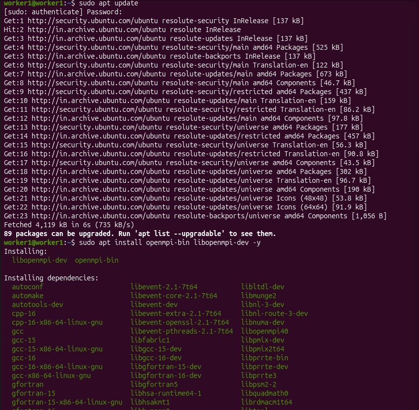 |

### 7.6 Worker Node Toolchain Verification
| Worker 1 Check | Worker 2 Check | Worker 3 Check |
| :---: | :---: | :---: |
| 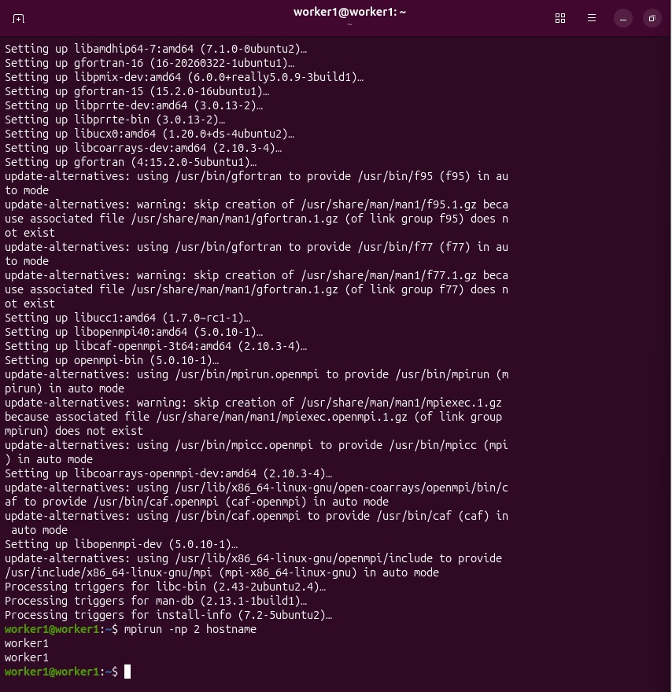 | 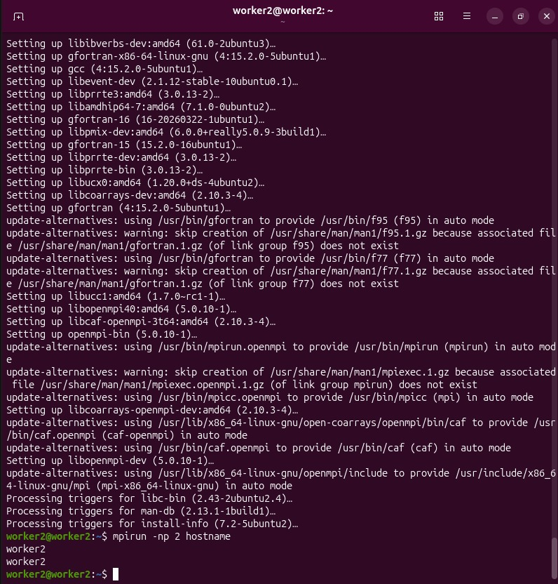 | 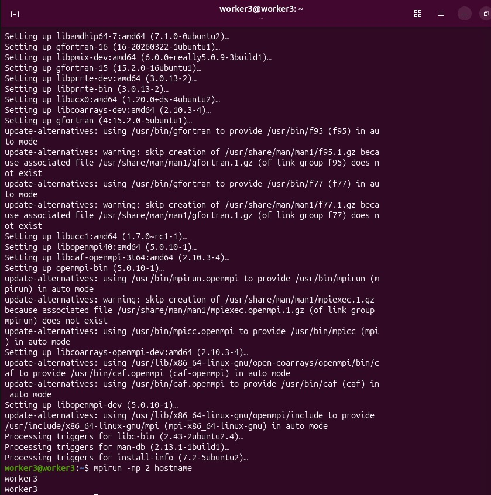 |

### 7.7 Program Staging & Message Passing Test
| SCP Binary Staging | Distributed Message Passing Execution |
| :---: | :---: |
| 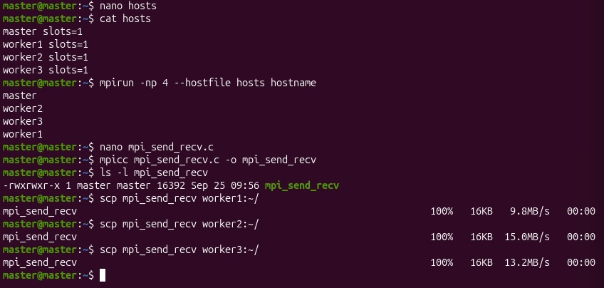 |  |

---

## 8. Performance Summary

| Metric | Sequential Baseline | MPI (4 Processes) | OpenMP (8 Threads) | CUDA (Massive GPU) |
| :--- | :--- | :--- | :--- | :--- |
| **Execution Time** | `244.120000 s` | `92.979510 s` | `40.545825 s` | **`0.343020 s`** |
| **Speedup ($S$)** | **1.00×** | **2.63×** | **6.02×** | **711.68×** |
| **Parallel Efficiency** | 100% | 65.8% | 75.3% | — |
| **Verification** | `PASS` | `PASS` | `PASS` | `PASS` |

$$\text{MPI Speedup} = \frac{244.120000}{92.979510} \approx \mathbf{2.63\times}$$
$$\text{Parallel Efficiency} = \frac{2.63}{4} \approx \mathbf{65.8\%}$$
